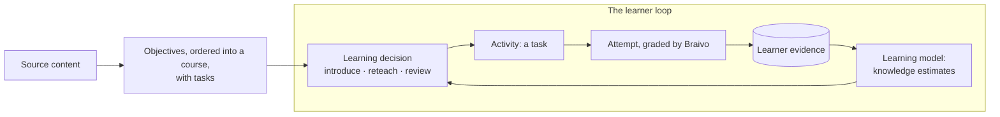

# Braivo

Adaptive learning powered by AI: turn existing educational content into a personal AI tutor.

Braivo is an open-source platform for educators, schools, training providers, and the products they build. It keeps an estimate of what each learner knows, and uses it to decide what that learner should do next, so a course adapts to the person taking it instead of running the same sequence for everyone.

- **Grounded in your content.** Braivo sequences and schedules what a content owner already teaches. AI may draft objectives and tasks from it, but the source stays authoritative, and every quote is checked against it.
- **Decisions that can be explained.** AI helps create learning material; it does not decide learning state. What comes next follows deterministically from recorded evidence and a [specified selection rule](docs/specs/learning-model.md), not from a prompt.
- **White-label.** An organization runs the learner experience under its own brand and at its own address, with no Braivo branding.
- **API-first.** Anything the apps do, another application can do over the HTTP API.
- **Built for self-hosting.** This repository is the whole platform: API, learning model, database schema, learn app, and console. Braivo Cloud adds managed hosting and operations; nothing here depends on it.

## Status

> [!IMPORTANT]
> Pre-release and not production-ready: the HTTP API, the database schema, and both apps change without deprecation or a compatibility layer.

- **Working:** accounts and organizations; courses drafted from PDFs, photos, and video captions, with multiple-choice tasks that cite their source; the adaptive learner loop, which follows a wrong answer with the passage its task came from; learner and course progress; and evidence graded elsewhere.
- **Not yet:** task kinds beyond multiple choice, feedback generated per answer, enrolling learners in a course (organization membership stands in for it), and deployment packaging.

## How it works



1. A content owner adds **source content** — the text of a PDF, a photo, or a video's captions — and turns it into **objectives**, ordered into a **course**, with **tasks** to practise each. Braivo's AI or the owner's own agent may draft them; every task cites the passage it was written from.
2. A learner submits an **attempt**; Braivo grades it and records the outcome as **learner evidence**. An application that grades elsewhere can record evidence directly.
3. The **learning model** replays that evidence into a knowledge estimate per objective. It is a pure function of the history: the same evidence always yields the same estimate, and a changed model recomputes estimates from the history instead of migrating stored state.
4. A **learning decision** picks one objective and why it comes next — introduce, reteach, or review — from those estimates and the course's order; Braivo then picks one of that objective's tasks as the learner's next activity.

## Quick start

Requires [Bun](https://bun.com), PostgreSQL with its `createdb`, and a POSIX shell.

```bash
bun install
createdb braivo
createdb braivo_test
cat > .env <<ENV
DATABASE_URL=postgres://localhost/braivo
TEST_DATABASE_URL=postgres://localhost/braivo_test
BETTER_AUTH_SECRET=$(openssl rand -base64 32)
BRAIVO_URL=http://localhost:5174
ENV
bun run db:migrate
bun run dev        # API on :3000, learn app on :5173, console on :5174
```

Then, in a second terminal: sign in to the console at `http://localhost:5174` as `owner@example.com`, with the code `bun run dev` prints in its log, and give that account an organization to manage:

```bash
bun apps/server/cli/index.ts organization create \
  --name "My School" --slug my-school --owner owner@example.com
```

Tests that need a database skip themselves without `TEST_DATABASE_URL`; give them a database of their own, since they create and delete fixture data. A linked worktree's tests use one of their own ([ADR 0014](docs/adr/0014-worktree-setup.md)).

```bash
bun run test       # Vitest, on Bun; not `vp test`, which starts Node
bunx vp check      # format, lint, and type-check; add --fix to fix
bun run storybook  # the component catalog
```

## Create a course

- **In the console, with Braivo's AI.** Add a PDF or a photo as a source, have Braivo draft objectives and tasks from it, and review them before creating the course. Needs `ANTHROPIC_API_KEY`.
- **With your own desktop agent.** `braivo mcp` gives Claude Desktop, Codex, or Grok Braivo's authoring as tools, so the drafting runs on your machine and your AI account; the same tools read how a course's learners are doing.
- **From the command line or the API.** `braivo sources add` adds text, a PDF's pages, or a video's captions; objectives, tasks, and courses come from either way above, or from your own scripts.

All three go through the same checks: every quote must be found in its source, and every task must pass the same validation. See the [authoring guide](docs/guides/authoring.md).

## The API

Braivo's apps use the same HTTP API as any integration: authoring content, asking for the next learning decision and activity, recording attempts or outside evidence, and reading progress. [The API, end to end](docs/guides/api.md) walks the whole loop with `curl`, and a test runs it as written.

## Development

The repository is one [Vite+](https://viteplus.dev) workspace ([ADR 0003](docs/adr/0003-workspace-layout.md)):

```text
apps/learn              the learn app, for learners
apps/console            the console, for content owners
apps/server             the API, the learning model, and the CLI, plus the browser client the apps import
apps/storybook          the component catalog, stories kept beside what they show
packages/db             schema, migrations, and database client
packages/ui             shadcn/ui components generated from a preset, and Braivo's own
packages/auth-client    signing in, for both apps
vite.config.ts          lint, format, test, and pre-commit rules for all of them
```

Each app's dev server proxies `/api` to the server, so the apps are same-origin with the API, as in production:

```text
browser apps ──▶ same-origin /api ──▶ Bun server ──▶ PostgreSQL
```

Schema changes go through generated, committed migrations: `bun run db:generate`, after `bun run --cwd apps/server auth:generate` for Better Auth's tables ([ADR 0005](docs/adr/0005-postgresql-drizzle.md)). [AGENTS.md](AGENTS.md) holds the working rules, for people and coding agents alike.

## Deployment

`bun run serve` serves the API alone; building the apps and putting them in front of it is yours to arrange until deployment is packaged. The [deployment guide](docs/guides/deployment.md) covers what to set before exposing it, the apps' layout, organizations and their domains, and configuration.

## Docs

- [Product](docs/product.md) — users, core jobs, principles, and non-goals
- [Architecture](docs/architecture.md) — the modules, their boundaries, and the dependency rules between them
- [Glossary](docs/glossary.md) — the terms the code and the docs both use
- [Guides](docs/guides/) — [authoring](docs/guides/authoring.md), [the API](docs/guides/api.md), [deployment](docs/guides/deployment.md)
- [Decisions](docs/adr/README.md) — what was decided, and why
- [Specifications](docs/specs/README.md) — behavior stated precisely and pinned by tests

## Contributing

Contributions are welcome: [CONTRIBUTING.md](CONTRIBUTING.md) covers how. Contributors sign the [Contributor License Agreement](docs/cla/v1.md) in their first pull request.

## License

Copyright © 2026 Konstantin Tarkus. Braivo's own code is licensed under [AGPL-3.0-only](LICENSE): if you modify Braivo and offer it to users over a network, you must offer those users the complete corresponding source of the version they are using, under the same license.

Third-party code, such as the shadcn/ui components, keeps its upstream license, as `REUSE.toml` records. A commercial license for Braivo's code is available for use that cannot comply with the AGPL: hello@braivo.app. A separate application does not become subject to Braivo's AGPL solely because it communicates with Braivo over its HTTP API.

The repository follows [REUSE](https://reuse.software); `bun run license:check` verifies it (needs [uv](https://docs.astral.sh/uv/)). Rationale in [ADR 0002](docs/adr/0002-agpl-only.md).
