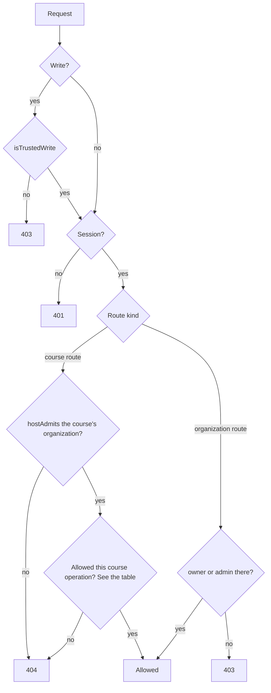

# Access

Status: living; checked against the code on 2026-10-02.

How people sign in, and what they reach once in. Whoever proves an email has an account, and an account alone reaches nothing: what a person may see or do in an organization follows from their membership in it and the organization roles it carries. The server decides every request from the session's user and the member record, never from what the request names.

## How it works

### Accounts and sessions

- Better Auth ([ADR 0006](../adr/0006-better-auth.md)) serves `/api/auth/*`. An account is made, and signed in to, only with a code sent to its email (Better Auth's `emailOTP`, [ADR 0018](../adr/0018-sign-in-and-invitations.md)): six digits, stored hashed, good once, for ten minutes and five guesses. Every address gets a code, so asking says nothing of whether an account exists; the first sign-in makes it, verified, named by the request's `name`. No passwords: none is taken, set, or reset.
- Only sign-in codes are sent; the plugin's endpoints for verifying an email, resetting a password, or changing an email are `disabledPaths`. An address gets one code a minute, whoever asks (`claimSignInCode`: its own `verification` row, claimed in one statement, which spending the code's guesses does not reset). Per client, Better Auth allows ten code requests a minute, in production only, keyed on `X-Forwarded-For` (README, Deployment).
- Codes go out over SMTP, or into the server's log of an installation listening on loopback alone ([ADR 0033](../adr/0033-email-over-smtp.md)).
- Asking for a code and redeeming it pass `isTrustedWrite` (below): Better Auth checks the origin only of a request carrying a cookie, so otherwise another site could sign a visitor in to an account whose code it holds.
- The console's `/login` renders `EmailSignIn` from `packages/auth-client`: an email, the code sent to it, then, for an account without a name, a name. After sign-in it goes to the `redirect` search parameter if `safeRedirect` keeps it within the origin, else `/`.
- On any host but `BRAIVO_URL`'s, before authentication, the server answers `401` to a request carrying `Authorization`, and `404` to Better Auth (`/api/auth/*`), the handoff's installation end (`/api/handoffs*`), and the console's `/api/organizations*`: an organization's domain serves its learn app and nothing else ([ADR 0004](../adr/0004-one-application-origin.md)).
- A content owner's tools — the `braivo` CLI and its MCP server — get a session token through the device flow, approved at the console's `/device`, and send it as `Authorization: Bearer` ([ADR 0022](../adr/0022-machine-access.md)). Of `/api/auth/*`, a token reaches `get-session` and `sign-out` (its own session, for `braivo logout`) only; anything else answers `403`. A tool finds the organizations it may work in at `GET /api/organizations`: those the person manages. No answer to a token sets a cookie, its session's renewal included.

### Learn domains: handoff and learner session

An organization's domain never holds the account's session or takes its credentials: it holds a learner session, Braivo's own, handed over from the installation's origin ([ADR 0018](../adr/0018-sign-in-and-invitations.md)). The flow is OAuth's authorization code flow in miniature.

1. The learn app's `/login`, on a host serving an organization, loads the domain's `/api/session/sign-in?redirect=<path>`. It records a handoff (`learner_handoff`: the organization and hostname from the request's host, the path if it stays on the domain, else `/`, the nonce's hash, 15 minutes), sets the nonce in `__Host-braivo-handoff`, and redirects to `BRAIVO_URL/login?handoff=<id>`.
2. There the console names the organization and the domain (`GET /api/handoffs/:id`; the tab's title too), not Braivo. With an account already signed in, it offers "Continue as <name>" (its email while it has none, to be named first) or "Use another account", which signs that one out; otherwise it signs in by code, name step included. A session found ended meanwhile goes back to signing in. Then `POST /api/handoffs/:id`, a trusted write, checks that the account is a member of the organization, then issues a code good for 60 seconds but never past the handoff's 15 minutes, replacing any issued before, and the page navigates to `https://<hostname>/api/session/handoff?code=…`. A POST from a click, never a navigation, so no link hands a signed-in visitor over unasked. A handoff no longer available reads as expired, without Braivo's name; when that happens mid-sign-in, the page links to `https://<hostname>/login`, where the domain, while it serves the organization, starts another.
3. That route redeems the code in one transaction, only with the nonce cookie, on the hostname the handoff began on, before it expires, and while that hostname still serves its organization. It sets `__Host-braivo-learner` (a week, renewed by use once a day old) and redirects to the stored path, `Referrer-Policy: no-referrer`. Anything else spends nothing and redirects to `/login?failed=1`, where the learn app, unless the learner is signed in already, says the sign-in did not finish and offers it again, on a click only: a handoff failing every time (cookies blocked) cannot cycle unseen.

- Every secret is random, 256 bits, and stored only as its SHA-256. Both cookies are `__Host-`: `Secure`, `HttpOnly`, `SameSite=Lax`, on that host alone. Expired handoffs and sessions are deleted as new ones are written.
- A learner session fixes a user, an organization, and the domain it was handed to, and grants nothing: it is read only on that domain while it still serves that organization (a token kept by a domain's former operator opens nothing on the organization's next domain), by the learner routes alone (`learnerFor`: `/api/courses`, `…/next`, `…/activity`, `…/attempts`, `…/learners/:learnerId/progress`, its own only), which check membership on every request as before. Elsewhere on a learn domain, `sessionFor` answers no session, so an account cookie there counts for nothing.
- `GET /api/session` answers who is signed in on the host asked, and `POST /api/session/sign-out` ends that host's session: on a learn domain its learner session alone, on the installation's the account's. The learn app's guard and sign-out use them.
- On the installation's host, which serves the learn app only in development, learner routes take the account's session, and the learn app's `/login` signs in by code there.
- Every `/api/auth/*` answer is `Cache-Control: private, no-store`, and bodies over 1 MB answer `413`.
- `_signed-in/route.tsx` in each app calls `requireSession` in `beforeLoad`: it asks for the session on every navigation (the console Better Auth, the learn app `GET /api/session`), redirects a signed-out visitor, or an account without a name, to `/login?redirect=<href>`, where `needsName` starts sign-in at the name, and throws rather than signing out when the session cannot be checked, so the page says something went wrong and offers Try again. Its Sign out, when it fails, keeps the page and says it could not sign out; clicking again retries.
- On the server, a route resolves the session itself — `sessionFor`, the account's, forwarding Better Auth's renewal cookie; or `learnerFor` on learner routes, above — and hands `application` plain user IDs. `application` never imports `auth`.

### Organizations, members, and roles

- An organization is created only by the operator: `braivo organization create --name --slug --owner <email>` (`bun apps/server/cli/index.ts organization create …` from a checkout) calls `createOrganization`, which needs an account that has already signed in and makes it the `owner`. `allowUserToCreateOrganization: false` refuses every session; Better Auth refuses an HTTP request naming a `userId` without one.
- Organization hooks in `apps/server/auth/auth.ts` enforce the slug rules ([white-label](white-label.md)) and refuse deleting an organization that still owns objectives, courses, sources, or files with `409`. The adapter runs with `transaction: true`, so a refused delete keeps its members.
- A member record carries one or more organization roles, comma-separated. `readOrganizationRoles` splits them; migration `0001_member_uniqueness.sql` allows one member record per user and organization, so a removed administrator cannot survive in a duplicate row.
- Membership is enrollment: a member in any role reaches every course of its organization ([learner loop](learner-loop.md)).
- Better Auth's invitations are off until ADR 0018 guards them with a verified email and a learn-domain check: its seven invitation endpoints are `disabledPaths`, which Better Auth answers `404` on every host. Unguarded, whoever signs up with an invited email joins. `addMember` has no HTTP path, so nothing over HTTP adds a member.

| Ability                                                  | `owner` | `admin` | `member` | Checked by                             |
| -------------------------------------------------------- | ------- | ------- | -------- | -------------------------------------- |
| List and study the organization's courses                | yes     | yes     | yes      | `isMember`, `hostAdmits`               |
| Author objectives, tasks, courses; record evidence       | yes     | yes     | no       | `assertMayAdminister`                  |
| Read a learner's progress                                | yes     | yes     | own only | progress-1 ([progress](progress.md))   |
| Read a course's overview of every member                 | yes     | yes     | no       | progress-12                            |
| Appear in `GET /api/organizations` and the console       | yes     | yes     | no       | `listManagedOrganizations`             |
| Rename the organization                                  | yes     | yes     | no       | Better Auth's default access control   |
| Delete the organization                                  | yes     | no      | no       | Better Auth's default access control   |
| List the organization's members (user IDs, names, roles) | yes     | yes     | no       | `assertMayAdminister`                  |
| Create an organization (operator's command only)         | no      | no      | no       | `allowUserToCreateOrganization: false` |

- `GET /api/organizations` answers the organizations the session's user manages, by name; the console resolves `/<slug>` among them ([white-label](white-label.md)).
- The console's learner page reads members through `GET /api/organizations/:organizationId/members`, and its course page through the course's overview (progress-11): user IDs, names, and every role; no emails, no cap. Better Auth's `list-members`, `get-full-organization`, `get-active-member-role`, `remove-member`, and `update-member-role` are `disabledPaths` too, since each serves or leaks to any member (why: `apps/server/auth/auth.ts`). Adding, removing, or changing the role of another member takes the database.

### Write origins

- Braivo's own writes pass `isTrustedWrite` before the session is resolved: the media type must be `application/json`, and an `Origin`, if sent, must be the host's own: `BRAIVO_URL`'s on the installation's host, and on an organization's domain that domain, while it is one (`isOrganizationOrigin`: HTTPS, default port, looked up per request). A learn domain cannot write through the console's session.
- Better Auth runs its own origin check with `disableOriginCheck: false`, so tests see it too. It trusts `BRAIVO_URL`'s origin alone, never an organization's domain.

### Planned (ADR 0018)

[ADR 0018](../adr/0018-sign-in-and-invitations.md) still turns Better Auth's invitation endpoints, refused today, into Braivo's invitation flow to an organization as `member` or `admin`, and adds Google to `/login`. Built so far: the operator command, email codes in place of passwords, and learner sessions handed over to learn domains; see Gaps.

## Invariants

- A request naming an organization authorizes nothing; the actor's role there is checked on every organization route that reads or writes anything (an empty evidence batch does neither). `apps/server/api/app.test.ts`, `apps/server/application/objectives.test.ts`, `apps/server/application/tasks.test.ts`, `apps/server/application/courses.test.ts`
- A `member` never authors or records evidence. `apps/server/api/app.test.ts`, `apps/server/application/record-evidence.test.ts`
- The learner is the session's user, never a value from the request. `apps/server/api/app.test.ts`
- A learner route answers a course outside the learner's organizations as `404`, like a missing one. `apps/server/api/app.test.ts`, `apps/server/application/learner-in-course.test.ts`
- Braivo's role checks split roles, never compare them whole: a `member` who also holds `admin` administers. `apps/server/persistence/membership.test.ts`, `apps/server/application/permission.test.ts`
- One member record per user and organization. `apps/server/persistence/membership.test.ts`
- Better Auth answers its invitation endpoints `404`, even requests they would carry out; a stored invitation stays pending and admits no one. `apps/server/auth/auth.test.ts`
- Only an `owner` or `admin` lists an organization's members, and never with emails; Better Auth answers its own member listings, removal, and role changes `404`, even to an owner. `apps/server/api/app.test.ts`, `apps/server/auth/auth.test.ts`
- No session creates an organization; the operator's command does, for an existing account only. `apps/server/auth/auth.test.ts`
- An organization owning learning content is not deleted, and a refused delete keeps its members. `apps/server/auth/auth.test.ts`
- No password makes or opens an account; only an emailed code does, which is stored hashed and good once. `apps/server/auth/auth.test.ts`
- An address gets one code a minute, however its guesses were spent and however many ask at once; only sign-in codes are sent. `apps/server/auth/auth.test.ts`, `apps/server/persistence/sign-in-code.test.ts`
- A code is asked for and redeemed only as JSON from the host's own origin. `apps/server/api/app.test.ts`
- An account without a name reaches no signed-in page. `packages/auth-client/require-session.test.ts`, `apps/console/routes.test.tsx`
- An installation others reach does not start without a way to send email. `apps/server/cli/config.test.ts`
- A bearer token, Better Auth, and the console's API reach nothing on a learn domain, and a token manages no account. `apps/server/api/app.test.ts`
- A learn domain's learner routes accept its learner session alone, one handed to that domain, and only while it serves the session's organization; it reads its own progress only, and reaches nothing once its user stops being a member. `apps/server/api/app.test.ts`, `apps/server/application/learner-sessions.test.ts`
- A handoff's code is issued only after a membership check, and opens a learner session once, only in the browser that began it, on the domain it began on, within a minute; a mismatch spends nothing; it returns only within that domain. (Membership lost in that minute is caught by the learner routes, which recheck it.) `apps/server/application/learner-sessions.test.ts`, `apps/server/api/app.test.ts`
- An account already signed in is offered, never used unasked, when signing in for a learn domain. `apps/console/routes.test.tsx`
- A forgeable write is refused before it records anything; a foreign origin is refused by Braivo and by Better Auth. `apps/server/api/app.test.ts`, `apps/server/auth/auth.test.ts`
- An organization's domain is trusted, for Braivo's own writes only, while it maps to an organization. `apps/server/auth/origin.test.ts`, `apps/server/auth/auth.test.ts`
- `GET /api/organizations` lists only managed organizations, only to a session, never cached. `apps/server/api/app.test.ts`
- A signed-out visitor reaches `/login` with a way back, and nothing is fetched first; a redirect never leaves the origin. `packages/auth-client/require-session.test.ts`, `packages/auth-client/redirect.test.ts`, `apps/learn/routes.test.tsx`, `apps/console/routes.test.tsx`

## Code map

| Concern                                                    | Where                                                                                                                                |
| ---------------------------------------------------------- | ------------------------------------------------------------------------------------------------------------------------------------ |
| Better Auth config, organization hooks, trusted origins    | `apps/server/auth/auth.ts`, `apps/server/auth/origin.ts`, `apps/server/auth/slug.ts`                                                 |
| Operator creates an organization                           | `apps/server/cli/index.ts`, `apps/server/auth/organization.ts`                                                                       |
| Mount, host gate, bearer limits, session, `isTrustedWrite` | `apps/server/api/app.ts`; contract in `apps/server/api/index.ts`                                                                     |
| Handoff and learner session                                | `apps/server/application/learner-sessions.ts`, `apps/server/persistence/learner-session.ts`, `packages/db/schema/learner-session.ts` |
| Role checks                                                | `apps/server/application/permission.ts`, `apps/server/application/organizations.ts`                                                  |
| Membership queries                                         | `apps/server/persistence/membership.ts`                                                                                              |
| Tables, member uniqueness                                  | `packages/db/schema/auth.ts`, `packages/db/migrations/0001_member_uniqueness.sql`                                                    |
| Browser client, form, guard, redirect                      | `packages/auth-client/`                                                                                                              |
| Sign-in codes: limit per address, mail                     | `apps/server/persistence/sign-in-code.ts`, `apps/server/mail/`, `apps/server/cli/config.ts`                                          |
| Console pages                                              | `apps/console/routes/login.tsx`, `_signed-in/route.tsx`, `_signed-in/$organizationSlug/route.tsx`, `apps/console/lib/auth.ts`        |
| Learn app pages                                            | `apps/learn/routes/login.tsx`, `apps/learn/routes/_signed-in/route.tsx`, `apps/learn/lib/auth.ts`                                    |
| Signing in for a learn domain                              | `apps/console/routes/login.tsx`                                                                                                      |

## Decisions

- [ADR 0004](../adr/0004-one-application-origin.md): one origin per app; the console addresses organizations by slug.
- [ADR 0005](../adr/0005-postgresql-drizzle.md): hand-written migrations, like member uniqueness, are the justified exception.
- [ADR 0006](../adr/0006-better-auth.md): Better Auth owns identity and membership; organization context is not authorization.
- [ADR 0010](../adr/0010-hono-http-layer.md): a route resolves the session and passes user IDs to one use case.
- [ADR 0011](../adr/0011-ui-and-auth-client-packages.md): browser sign-in lives in `packages/auth-client`.
- [ADR 0016](../adr/0016-route-files.md): `_signed-in/route.tsx` guards signed-in pages.
- [ADR 0018](../adr/0018-sign-in-and-invitations.md): email-code sign-in, invitations, learner sessions handed over to each learn domain; operator-created organizations.
- [ADR 0033](../adr/0033-email-over-smtp.md): email over SMTP, or to the log of a loopback installation.
- [ADR 0022](../adr/0022-machine-access.md): content owners' tools sign in by the device flow and act as them, on the installation's host only.

## Gaps

| Gap                                                                                                                              | Impact                                                                                         | Next step                                                  |
| -------------------------------------------------------------------------------------------------------------------------------- | ---------------------------------------------------------------------------------------------- | ---------------------------------------------------------- |
| No Braivo way to add a learner or admin to an organization.                                                                      | Learners get in only by seeding the database.                                                  | Build ADR 0018 invitations (after email code and handoff). |
| Better Auth's default `membershipLimit` of 100 applies to the members it adds; no schema caps them.                              | Its member-adding flows stop at 100 members.                                                   | Set `membershipLimit` deliberately.                        |
| Whether a member may leave is undecided: Better Auth's `organization/leave` lets any member but an organization's sole owner.    | A learner can end their own enrollment.                                                        | Maintainer decides; then a rule and a test, or disable it. |
| Signing in for a learn domain cannot run locally: it needs the domain over HTTPS and a separate console origin serving `/login`. | The handoff is proven by the API's tests and the console's route tests only.                   | A local HTTPS proxy setup, when someone needs it.          |
| No console UI to change members, roles, or the organization's settings.                                                          | Changing another member takes the database; renaming the organization, a raw Better Auth call. | Follows invitations; scope with ADR 0018 step 3.           |
