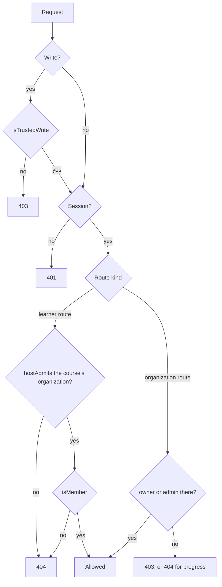

# Access

Status: living; checked against the code on 2026-10-02.

How people sign in, and what they reach once in. Anyone may create an account, and an account alone reaches nothing: what a person may see or do in an organization follows from their membership in it and the organization roles it carries. The server decides every request from the session's user and the member record, never from what the request names.

## How it works

### Accounts and sessions

- Better Auth ([ADR 0006](../adr/0006-better-auth.md)) serves `/api/auth/*`, with email and password as the only sign-in method. No email is verified and no password can be reset.
- The console offers `/login` and `/signup`; the learn app offers `/login` only. Both render `EmailSignIn` from `packages/auth-client`. After sign-in, each app goes to the `redirect` search parameter if `safeRedirect` keeps it within the origin, else `/`. After sign-up, the console goes to `/`, since a new account manages no organization.
- On any host but `BRAIVO_URL`'s, before authentication, the server answers `401` to a request carrying `Authorization`, and `404` to `/api/auth/sign-up/*`, the device flow (`/api/auth/device*`), and the console's `/api/organizations*`: an organization's domain serves its learn app and nothing else ([ADR 0004](../adr/0004-one-application-origin.md)), and an account made there would belong to no organization. Hiding the learn app's form is not the boundary.
- A content owner's tools — `braivo login`, `braivo mcp` — get a session token through the device flow, approved at the console's `/device`, and send it as `Authorization: Bearer` ([ADR 0022](../adr/0022-machine-access.md)). Of `/api/auth/*`, a token reaches `get-session` and `organization/list` only; anything else answers `403`. No answer to a token sets a cookie, its session's renewal included.
- Sign-in works on the installation's origin and on an organization's domain; either way the session is the whole account's, in a cookie on that host.
- Every `/api/auth/*` answer is `Cache-Control: private, no-store`, and bodies over 1 MB answer `413`.
- `_signed-in/route.tsx` in each app calls `requireSession` in `beforeLoad`: it asks Better Auth on every navigation, redirects a signed-out visitor to `/login?redirect=<href>`, and throws rather than signing out when the session cannot be checked.
- On the server, a route resolves the session itself (`sessionFor`), forwards Better Auth's renewal cookie, and hands `application` plain user IDs. `application` never imports `auth`.

### Organizations, members, and roles

- An organization is created only by the operator: `braivo organization create --name --slug --owner <email>` (`bun apps/server/cli/index.ts organization create …` from a checkout) calls `createOrganization`, which needs an account that has already signed up and makes it the `owner`. `allowUserToCreateOrganization: false` refuses every session; Better Auth refuses an HTTP request naming a `userId` without one.
- Organization hooks in `apps/server/auth/auth.ts` enforce the slug rules ([white-label](white-label.md)) and refuse deleting an organization that still owns objectives, courses, sources, or files with `409`. The adapter runs with `transaction: true`, so a refused delete keeps its members.
- A member record carries one or more organization roles, comma-separated. `readOrganizationRoles` splits them; migration `0001_member_uniqueness.sql` allows one member record per user and organization, so a removed administrator cannot survive in a duplicate row.
- Membership is enrollment: a member in any role reaches every course of its organization ([learner loop](learner-loop.md)).
- Better Auth's invitations are off until ADR 0018 guards them with a verified email and a learn-domain check: its seven invitation endpoints are `disabledPaths`, which Better Auth answers `404` on every host. Unguarded, whoever signs up with an invited email joins. `addMember` has no HTTP path, so nothing over HTTP adds a member.

| Ability                                                | `owner` | `admin` | `member` | Checked by                             |
| ------------------------------------------------------ | ------- | ------- | -------- | -------------------------------------- |
| List and study the organization's courses              | yes     | yes     | yes      | `isMember`, `hostAdmits`               |
| Author objectives, tasks, courses; record evidence     | yes     | yes     | no       | `assertMayAdminister`                  |
| Read a learner's progress                              | yes     | yes     | own only | progress-1 ([progress](progress.md))   |
| Appear in `GET /api/organizations` and the console     | yes     | yes     | no       | `listManagedOrganizations`             |
| Rename the organization                                | yes     | yes     | no       | Better Auth's default access control   |
| Delete the organization                                | yes     | no      | no       | Better Auth's default access control   |
| List the organization's members (names, emails, roles) | yes     | yes     | yes      | Better Auth: any member                |
| Create an organization (operator's command only)       | no      | no      | no       | `allowUserToCreateOrganization: false` |

- `GET /api/organizations` answers the organizations the session's user manages, by name; the console resolves `/<slug>` among them ([white-label](white-label.md)).
- The console's course page lists members through Better Auth's `organization/list-members`.

### Write origins

- Braivo's own writes pass `isTrustedWrite` before the session is resolved: the media type must be `application/json`, and an `Origin`, if sent, must be the host's own: `BRAIVO_URL`'s on the installation's host, and on an organization's domain that domain, while it is one (`isOrganizationOrigin`: HTTPS, default port, looked up per request). A learn domain cannot write through the console's session.
- Better Auth runs its own origin check with `disableOriginCheck: false`, so tests see it too. Its trusted origins are `BRAIVO_URL` plus the request's origin while it is an organization's domain.

### Planned (ADR 0018)

[ADR 0018](../adr/0018-sign-in-and-invitations.md) replaces passwords and `/signup` with one email-code and Google `/login` on the installation's origin, turns Better Auth's invitation endpoints, refused today, into Braivo's invitation flow to an organization as `member` or `admin`, and gives each learn domain a learner session handed over from that origin instead of the account's session. None of it is built beyond the operator command; see Gaps.

## Invariants

- A request naming an organization authorizes nothing; the actor's role there is checked on every organization route that reads or writes anything (an empty evidence batch does neither). `apps/server/api/app.test.ts`, `apps/server/application/objectives.test.ts`, `apps/server/application/tasks.test.ts`, `apps/server/application/courses.test.ts`
- A `member` never authors or records evidence. `apps/server/api/app.test.ts`, `apps/server/application/record-evidence.test.ts`
- The learner is the session's user, never a value from the request. `apps/server/api/app.test.ts`
- A learner route answers a course outside the learner's organizations as `404`, like a missing one. `apps/server/api/app.test.ts`, `apps/server/application/learner-in-course.test.ts`
- Roles are split, never compared whole. `apps/server/persistence/membership.test.ts`
- One member record per user and organization. `apps/server/persistence/membership.test.ts`
- Better Auth answers its invitation endpoints `404`, even requests they would carry out; a stored invitation stays pending and admits no one. `apps/server/auth/auth.test.ts`
- No session creates an organization; the operator's command does, for an existing account only. `apps/server/auth/auth.test.ts`
- An organization owning learning content is not deleted, and a refused delete keeps its members. `apps/server/auth/auth.test.ts`
- No sign-up on any host but the installation's. `apps/server/api/app.test.ts`; the learn app shows no sign-up: `apps/learn/routes.test.tsx`
- A bearer token, the device flow, and the console's API reach nothing on a learn domain, and a token manages no account. `apps/server/api/app.test.ts`
- A forgeable write is refused before it records anything; a foreign origin is refused by Braivo and by Better Auth. `apps/server/api/app.test.ts`, `apps/server/auth/auth.test.ts`
- An organization's domain is trusted only while it maps to an organization. `apps/server/auth/origin.test.ts`
- `GET /api/organizations` lists only managed organizations, only to a session, never cached. `apps/server/api/app.test.ts`
- A signed-out visitor reaches `/login` with a way back, and nothing is fetched first; a redirect never leaves the origin. `packages/auth-client/require-session.test.ts`, `packages/auth-client/redirect.test.ts`, `apps/learn/routes.test.tsx`, `apps/console/routes.test.tsx`

## Code map

| Concern                                                    | Where                                                                                                                                       |
| ---------------------------------------------------------- | ------------------------------------------------------------------------------------------------------------------------------------------- |
| Better Auth config, organization hooks, trusted origins    | `apps/server/auth/auth.ts`, `apps/server/auth/origin.ts`, `apps/server/auth/slug.ts`                                                        |
| Operator creates an organization                           | `apps/server/cli/index.ts`, `apps/server/auth/organization.ts`                                                                              |
| Mount, host gate, bearer limits, session, `isTrustedWrite` | `apps/server/api/app.ts`; contract in `apps/server/api/index.ts`                                                                            |
| Role checks                                                | `apps/server/application/permission.ts`, `apps/server/application/organizations.ts`                                                         |
| Membership queries                                         | `apps/server/persistence/membership.ts`                                                                                                     |
| Tables, member uniqueness                                  | `packages/db/schema/auth.ts`, `packages/db/migrations/0001_member_uniqueness.sql`                                                           |
| Browser client, form, guard, redirect                      | `packages/auth-client/`                                                                                                                     |
| Console pages                                              | `apps/console/routes/login.tsx`, `signup.tsx`, `_signed-in/route.tsx`, `_signed-in/$organizationSlug/route.tsx`, `apps/console/lib/auth.ts` |
| Learn app pages                                            | `apps/learn/routes/login.tsx`, `apps/learn/routes/_signed-in/route.tsx`                                                                     |

## Decisions

- [ADR 0004](../adr/0004-one-application-origin.md): one origin per app; the console addresses organizations by slug.
- [ADR 0005](../adr/0005-postgresql-drizzle.md): hand-written migrations, like member uniqueness, are the justified exception.
- [ADR 0006](../adr/0006-better-auth.md): Better Auth owns identity and membership; organization context is not authorization.
- [ADR 0010](../adr/0010-hono-http-layer.md): a route resolves the session and passes user IDs to one use case.
- [ADR 0011](../adr/0011-ui-and-auth-client-packages.md): browser sign-in lives in `packages/auth-client`.
- [ADR 0016](../adr/0016-route-files.md): `_signed-in/route.tsx` guards signed-in pages.
- [ADR 0018](../adr/0018-sign-in-and-invitations.md): email-code sign-in, invitations, learner sessions per learn domain; operator-created organizations.
- [ADR 0022](../adr/0022-machine-access.md): content owners' tools sign in by the device flow and act as them, on the installation's host only.

## Gaps

| Gap                                                                                                                                             | Impact                                                                                             | Next step                                                                              |
| ----------------------------------------------------------------------------------------------------------------------------------------------- | -------------------------------------------------------------------------------------------------- | -------------------------------------------------------------------------------------- |
| No Braivo way to add a learner or admin to an organization.                                                                                     | Learners get in only by seeding the database.                                                      | Build ADR 0018 invitations (after email code and handoff).                             |
| Better Auth's default `membershipLimit` of 100 applies: adding a member fails past 100.                                                         | An organization cannot pass 100 learners; the console roster silently truncates.                   | Set `membershipLimit` deliberately and page the roster.                                |
| Any `member` can call `organization/list-members` or `get-full-organization` and read every member's name and email, and a stored invitation's. | Learners see each other's emails.                                                                  | Decide the rule; restrict with a hook or custom access control.                        |
| No email verification and no password reset.                                                                                                    | Anyone can sign up with someone else's email; a forgotten password locks the account out.          | ADR 0018 step 1 (email code) removes both problems.                                    |
| A learn domain holds the account's full session and accepts `/api/auth/*` but sign-up and the device flow.                                      | A console-grade session lives on every learn domain, so only operator-controlled domains are safe. | ADR 0018 step 2: learner session and handoff; drop learn domains from trusted origins. |
| No console UI to manage members, roles, or the organization; only Better Auth endpoints.                                                        | Removing a learner or promoting an admin needs raw API calls.                                      | Follows invitations; scope with ADR 0018 step 3.                                       |
