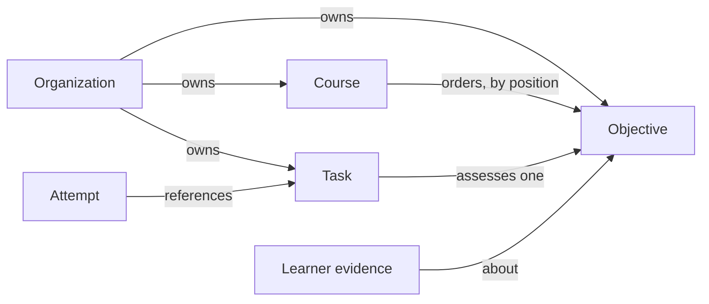

# Authoring

Status: living; checked against the code on 2026-09-28.

Content owners define what their learners study: objectives, courses that order them, and tasks that assess them. This is the hand-written first step toward [product.md](../product.md)'s core job 1, "turn existing materials into structured learning content". [Sources](sources.md) and [generation](generation.md) from them do not exist yet, so everything here is authored over the HTTP API, one request at a time.

## How it works

An organization owns its objectives, courses, and tasks. A course orders objectives without owning them, so one objective may appear in several courses and keeps one knowledge estimate per learner. A task assesses exactly one objective and serves every course that objective is in.

The authoring order is fixed by references: objectives first, then courses and tasks over their IDs. The README's "The API, end to end" walks it with `curl`.

| Endpoint                                   | Body                                                    | Success                                                |
| ------------------------------------------ | ------------------------------------------------------- | ------------------------------------------------------ |
| `POST /api/organizations/:id/objectives`   | `{ "titles": ["…"] }`                                   | 201 `{ "objectiveIds": [...] }`, positionally matching |
| `GET /api/organizations/:id/objectives`    | —                                                       | 200 `{ "objectives": [{ "id", "title" }] }`, by title  |
| `POST /api/organizations/:id/courses`      | `{ "title": "…", "objectiveIds": [...] }`               | 201 `{ "courseId": "…" }`                              |
| `GET /api/organizations/:id/courses`       | —                                                       | 200 `{ "courses": [{ "id", "title" }] }`, by title     |
| `POST /api/organizations/:id/tasks`        | `{ "tasks": [{ "objectiveId", "kind": "choice", … }] }` | 201 `{ "taskIds": [...] }`, positionally matching      |
| `POST /api/organizations/:id/tasks/retire` | `{ "taskIds": [...] }`                                  | 204, also when already retired                         |

Rules every authoring route shares (full statuses in `apps/server/api/index.ts`):

- **Who.** The actor is the session's user and must hold `owner` or `admin` in the organization: a content owner, the same check as grading. A `member` is a learner and gets 403. The `:id` in the path proves nothing on its own ([access.md](access.md)).
- **Writes** pass the origin check in [access](access.md), else 403; at most 1000 items and 1 MB per request.
- **Order of checks.** A malformed body answers 400 before the role is checked, since the payload alone reveals nothing about the organization. Then the role (403), then ownership of every referenced objective (403, also for one that does not exist).
- **All or nothing.** A batch with one invalid item stores nothing.
- **IDs** are opaque UUIDs Braivo generates, never a title, so two organizations can both have "Past tense".
- **Listings are by title, then ID**, so equal titles keep a stable order. Content order belongs only to a course.

Objectives: titles are trimmed and must be non-blank. Nothing else is checked; duplicate titles are allowed.

Courses: the title is trimmed and non-blank. `objectiveIds` may be empty, lists each objective at most once, and its order is the content order selection works from ([learning-model.md](learning-model.md)). The course and its membership rows are written in one transaction. A course with no objectives, or none with tasks, leaves its learners with no activity ([learner-loop.md](learner-loop.md)).

Tasks: `content` validates the body by `kind`. `choice` is the only kind: a non-blank `prompt`, 2 to 26 distinct non-blank `options`, `answer` the index of the correct one, an optional non-blank `explanation` shown after grading, and optional `keepOrder: true` to present options as written instead of shuffled. Text is trimmed. Tasks in one batch are stamped a millisecond apart, so a learner meets them in the order given.

Retiring withdraws a task from practice for good: it is never offered and accepts no new attempt, but stays stored, since attempts point at it, and the evidence it graded still counts. Retiring again keeps the first date; a batch with a task the organization does not own retires nothing (403).

What an author cannot do: edit, reorder, or delete anything; read tasks back; read a course's objectives except through a learner's progress report ([progress.md](progress.md)). Tasks are immutable by design; for objectives and courses the path simply does not exist. The database refuses to delete an objective a course or task uses, and Better Auth's organization delete answers 409 while the organization owns objectives or courses.

Console: none of this is in the console. It lists an organization's courses and a course's members, and an empty organization reads "Courses are published through the API for now." The browser client (`@braivo/server/client`) has only `listCourses`.

## Invariants

- Only `owner` or `admin` of the organization may create or list its objectives, courses, and tasks. `apps/server/application/objectives.test.ts`, `apps/server/application/courses.test.ts`, `apps/server/application/tasks.test.ts`, `apps/server/api/app.test.ts`
- A malformed course or task is refused before the actor's role is read. `apps/server/application/courses.test.ts`, `apps/server/application/tasks.test.ts`
- A course arranges only its own organization's objectives, enforced by the use case and by composite foreign keys. `apps/server/application/courses.test.ts`, `apps/server/persistence/course.test.ts`
- A task assesses only its own organization's objective, enforced by the use case and by a composite foreign key; the key alone is untested. `apps/server/application/tasks.test.ts`
- A course keeps its objectives in the order given, each at most once, no two at one position. `apps/server/persistence/course.test.ts`
- A course is created whole or not at all. `apps/server/persistence/course.test.ts`
- One invalid task refuses the whole batch. `apps/server/application/tasks.test.ts`
- A stored task body is a valid one of its kind. `apps/server/content/task.test.ts`
- Tasks from one batch are offered in the order given. `apps/server/application/tasks.test.ts`
- Generated IDs match the request's order, and two organizations get distinct objectives for the same title. `apps/server/persistence/objective.test.ts`, `apps/server/application/objectives.test.ts`
- An objective a course uses cannot be deleted; deleting a course removes only its arrangement. `apps/server/persistence/course.test.ts`
- An objective a task uses cannot be deleted. (untested)
- An organization that owns objectives or courses cannot be deleted. `apps/server/auth/auth.test.ts`, `apps/server/persistence/objective.test.ts`, `apps/server/persistence/course.test.ts`
- A task's authored content never changes once stored: there is no update path, and retiring records only when. (untested)
- A retired task is never offered, accepts no new attempt, and retiring twice is harmless; only an `owner` or `admin` retires, and only the organization's own tasks. `apps/server/application/tasks.test.ts`

## Code map

| Concern                   | Where                                                                                                             |
| ------------------------- | ----------------------------------------------------------------------------------------------------------------- |
| Routes and body parsing   | `apps/server/api/app.ts` (`parseTitles`, `parseCourse`, `parseTasks`)                                             |
| Public contract           | `apps/server/api/index.ts`                                                                                        |
| Use cases                 | `apps/server/application/objectives.ts`, `apps/server/application/courses.ts`, `apps/server/application/tasks.ts` |
| Permission check          | `apps/server/application/permission.ts` (`assertMayAdminister`)                                                   |
| Task kinds and validation | `apps/server/content/task.ts` (`parseTaskBody`)                                                                   |
| Queries                   | `apps/server/persistence/objective.ts`, `apps/server/persistence/course.ts`, `apps/server/persistence/task.ts`    |
| Tables                    | `packages/db/schema/learning.ts` (`objective`, `course`, `courseObjective`, `task`)                               |
| Organization delete guard | `apps/server/auth/auth.ts` (`beforeDeleteOrganization`)                                                           |
| Browser client            | `apps/server/api/client.ts`                                                                                       |
| Console screens           | `apps/console/routes/_signed-in/$organizationSlug/`                                                               |

## Decisions

- [ADR 0008](../adr/0008-courses-order-objectives.md): courses order objectives rather than own them, and position is erased at the storage boundary.
- [ADR 0015](../adr/0015-tasks.md): tasks are immutable, one objective each, with a JSON body per kind; `choice` first.
- [ADR 0006](../adr/0006-better-auth.md): organizations and roles come from Better Auth, and an organization ID in a request is not authorization.
- [ADR 0010](../adr/0010-hono-http-layer.md): a route resolves the session and calls one use case.
- [ADR 0005](../adr/0005-postgresql-drizzle.md): tables follow implemented requirements, which is why there is no module or lesson level.
- [ADR 0004](../adr/0004-one-application-origin.md): the console addresses an organization by slug at the installation's origin.

## Gaps

| Gap                                                                                          | Impact                                                                            | Next step                                                                       |
| -------------------------------------------------------------------------------------------- | --------------------------------------------------------------------------------- | ------------------------------------------------------------------------------- |
| No authoring UI in the console; client has no write methods                                  | Only developers with `curl` can author; content owners cannot                     | Console screens for objectives, courses, tasks, adding client methods with them |
| No edit of objective or course titles, though the schema comment calls `title` editable      | A typo is permanent; the comment describes a path that does not exist             | Add a rename endpoint, or correct the comment                                   |
| Courses cannot be reordered or extended after creation                                       | Any curriculum change means a new course ID that learners and links must move to  | Endpoint to replace a course's objective list                                   |
| Evidence graded by a task later retired still counts                                         | A wrong answer key may have marked right answers wrong, and estimates keep it     | Decide: discount, regrade, or leave it                                          |
| Nothing can be deleted, even unused drafts                                                   | Mistakes accumulate; organization deletion is blocked forever once content exists | Decide deletion for unused objectives, courses, and tasks                       |
| Tasks cannot be read back, nor a course's objective order                                    | Authors cannot review answer keys or verify a course                              | `GET` for an organization's tasks and a course's objectives                     |
| Creates are not idempotent                                                                   | A retried POST after a lost response duplicates objectives, courses, or tasks     | Client-supplied IDs, as attempts already use                                    |
| Batch order relies on `createdAt` offsets                                                    | Two batches sent close together can interleave                                    | Ordering column when authoring needs one (noted in `createTasks`)               |
| Only `choice`; one objective per task                                                        | Recall, free text, and multi-step problems cannot be assessed                     | Next kind per ADR 0015, with stored AI grades                                   |
| No length limits on titles, prompts, or options beyond 1 MB per body                         | One field can hold a megabyte that every screen must render                       | Per-field limits in the parsers                                                 |
| Authoring is `owner` or `admin`; no role that may author without grading or managing members | Organizations cannot delegate content work narrowly                               | Open question: wait for a customer need                                         |
