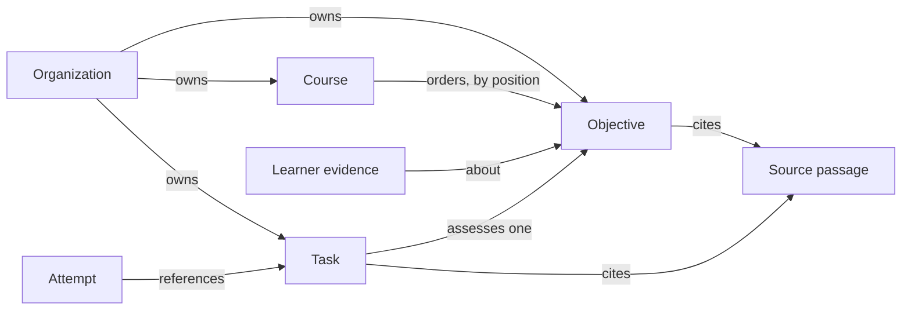

# Authoring

Status: living; checked against the code on 2026-10-02.

Content owners define what their learners study: objectives, courses that order them, and tasks that assess them. This is the authoring half of [product.md](../product.md)'s core job 1, "turn existing materials into structured learning content": material comes in as [sources](sources.md), a course may be drafted from it ([generation](generation.md)), and what the owner keeps is authored through the endpoints below, by the console accepting a draft, by a desktop agent through `braivo mcp`, or by any other caller of the HTTP API.

## How it works

An organization owns its objectives, courses, and tasks. A course orders objectives without owning them, so one objective may appear in several courses and keeps one knowledge estimate per learner. A task assesses exactly one objective and serves every course that objective is in. Objectives and tasks may cite passages of the organization's sources.

The authoring order is fixed by references: objectives first, then courses, citations, and tasks over their IDs. The README's "The API, end to end" walks it with `curl`.

| Endpoint                                                       | Body                                                                               | Success                                                                                              |
| -------------------------------------------------------------- | ---------------------------------------------------------------------------------- | ---------------------------------------------------------------------------------------------------- |
| `POST /api/organizations/:id/objectives`                       | `{ "objectives": [{ "title", "key"? }] }`                                          | 201 `{ "objectiveIds": [...] }`, positionally matching                                               |
| `GET /api/organizations/:id/objectives`                        | —                                                                                  | 200 `{ "objectives": [{ "id", "title" }] }`, by title                                                |
| `GET /api/organizations/:id/objectives/:objectiveId/tasks`     | —                                                                                  | 200 `{ "tasks": [...] }`: unretired, oldest first, as authored with `id` and `citations`; 404        |
| `GET /api/organizations/:id/objectives/:objectiveId/citations` | —                                                                                  | 200 `{ "citations": [{ "sourceId", "start", "end", "quote" }] }`; 404                                |
| `POST /api/organizations/:id/courses`                          | `{ "title", "objectiveIds": [...], "key"? }`                                       | 201 `{ "courseId": "…" }`                                                                            |
| `GET /api/organizations/:id/courses`                           | —                                                                                  | 200 `{ "courses": [{ "id", "title" }] }`, by title                                                   |
| `GET /api/organizations/:id/courses/:courseId`                 | —                                                                                  | 200 the course whole: objectives in order, each with citations and tasks, and the sources cited; 404 |
| `POST /api/organizations/:id/tasks`                            | `{ "tasks": [{ "objectiveId", "kind": "choice", …, "citations"?, "replaces"? }] }` | 201 `{ "taskIds": [...] }`, positionally matching                                                    |
| `POST /api/organizations/:id/tasks/retire`                     | `{ "taskIds": [...] }`                                                             | 204, also when already retired                                                                       |

Citing an objective (`POST …/citations`) and how a quote is located are the [sources](sources.md) spec's.

Rules every authoring route shares (full statuses in `apps/server/api/index.ts`):

- **Who.** The actor is the session's user, from a browser cookie or a device-flow bearer token sent to the installation's host ([ADR 0022](../adr/0022-machine-access.md)), and must hold `owner` or `admin` in the organization: a content owner, the same check as grading. A `member` is a learner and gets 403, reads included, since tasks read back carry their answers. The `:id` in the path proves nothing on its own ([access.md](access.md)).
- **Writes** pass the origin check in [access](access.md), else 403; at most 1000 items, 200 quotes to locate, and 1 MB per request.
- **Order of checks.** A malformed body answers 400 before the role is checked, since the payload alone reveals nothing about the organization: its shape, a key that cannot be one, a task invalid for its kind. Then the role (403), then ownership of every referenced objective and replaced task (403, also for one that does not exist), then each citation in turn: its source's ownership (403, likewise) and its quote (400).
- **Refusals explain themselves** where the caller can fix them, since the caller is often a model ([ADR 0021](../adr/0021-citations.md)): a refused title, a malformed or conflicting key, a course listing an objective twice, an invalid task, a quote Braivo cannot find, or a stale correction answers `{ "error" }` naming the item, as in "Task 1, citation 0: the quote does not occur in the source." A body not of the documented shape answers a bare 400.
- **All or nothing.** A batch with one invalid item stores nothing.
- **IDs** are opaque UUIDs Braivo generates, never a title, so two organizations can both have "Past tense".
- **Listings are by title, then ID**, so equal titles keep a stable order. Content order belongs only to a course.
- **Retries add nothing** ([ADR 0024](../adr/0024-idempotent-authoring.md)): a task by its content, an objective or course by the caller's key.

Objectives: titles are trimmed, non-blank, at most 500 characters, and storable text (no NUL, no unpaired surrogate). Duplicate titles are allowed. A `key`, optional, is the caller's name for the objective, unique in the organization: 1 to 128 lowercase letters, digits, and `. _ / -`, starting with a letter or digit. Sent again under its key with the same title, an objective answers its existing ID; under a key that names another title, the batch answers 409. A key repeated within one batch is one objective, on the same terms. Writers racing on one key share one objective. A key cannot be changed or released.

Courses: the title follows the objectives' rules. `objectiveIds` may be empty, lists each objective at most once, and its order is the content order selection works from ([learning-model.md](learning-model.md)). The course and its membership rows are written in one transaction. A `key` works as for objectives: the same title and objectives in the same order answer the existing ID, anything else under the key 409. A course is open to its organization's learners once created; there is no draft state. An objective without a task leaves a learner with no activity when it is the one selected, and caught up once it needs no attention, as in a course with no objectives ([learner-loop.md](learner-loop.md)).

Tasks: `content` validates the body by `kind`. `choice` is the only kind: a `prompt`, 2 to 26 distinct `options`, `answer` the index of the correct one, an optional `explanation` shown after grading, and optional `keepOrder: true` to present options as written instead of shuffled. Each text is trimmed, 1 to 2000 characters, and storable. The prompt and options are stored with each run of spaces, tabs, and line breaks as one space, as a page collapses them (a no-break space inside one stays), so options that differ only in that spacing, or only in Unicode form (`ż` composed or as `z` and a combining dot, equal in NFC), are refused as repeated rather than reading the same and grading differently; the console's task editor checks the same. Each is stored in the Unicode form sent. A task may cite at most 10 passages, `{ "sourceId", "quote" }`, located as an objective's are and stored in the task's transaction; a learner sees them only after answering ([learner-loop.md](learner-loop.md)). New tasks in one batch are stamped a millisecond apart, so a learner meets them in the order given.

A task the objective already has, unretired, with an equal body (key order aside; option order counts, since `answer` indexes it) and the same set of passages, is not stored again: its ID is answered, also for a task repeated within one batch. A retired twin does not count, so adding a retired task again brings it back as a new one. Adding and retiring lock the objectives they touch, so a twin is never answered as live after it was retired, and racing writers store one task.

Retiring withdraws a task from practice for good: it is never offered and accepts no new attempt, but stays stored, since attempts point at it, and the evidence it graded still counts. Retiring again keeps the first date; a batch with a task the organization does not own retires nothing (403). Tasks are immutable: a task sent with `replaces`, naming one of the organization's tasks (else 403), is its correction, and that task is retired in the same transaction, so learners meet one or the other. A correction is sent alone, for the task's own objective (else 400, explained): moving a task changes which courses ask it, so that is retiring and adding. An unchanged correction answers the task's ID, retiring nothing. Once the task is retired, a correction answers what it asks for if that is already offered, as on a retry after a lost answer, and otherwise 409, explained: it was written from a stale read.

Reading back: an objective's tasks, answers and passages included, in the shape they are authored in, so one read back can be sent again; an objective's citations; and a course whole, its objectives in content order, each with its citations and unretired tasks, plus each cited source once, without text. Another organization's objective or course answers 404, as one that does not exist.

What an author cannot do: edit, reorder, or delete anything, including a citation. Tasks are immutable by design; for objectives, courses, and citations the path does not exist. The database refuses to delete an objective anything refers to, and Better Auth's organization delete answers 409 while the organization owns objectives, courses, sources, or files.

Console: an organization's page lists its courses (while it has none, a button to its sources) and links its sources, where a course is drafted from a source and authored once reviewed ([generation](generation.md)). A course's page opens with each objective's learners counted by standing, then each member's objectives, linked to their progress ([progress.md](progress.md)), then shows the course whole for review: each objective's passages, then its tasks with their answers, explanations, and passages, with a Retire button that asks first and an Edit button that corrects the task, keeping its passages and option order. Objectives and courses are not written by hand there, and tasks only as corrections.

Desktop agents: `braivo mcp`, a command of the CLI, serves the endpoints above as tools (`define_objectives`, `cite_sources`, `author_tasks`, `list_tasks`, `retire_tasks`, `create_course`, `read_course`, and the listings) acting as the signed-in content owner, with no rule of its own beyond the API's ([ADR 0023](../adr/0023-mcp-server.md)). Its instructions ask the agent for a key on every objective and course and to resend it on a retry, and it hands Braivo's explanation of a refusal back to the agent. It also reads a course's progress ([progress](progress.md), progress-16). The browser client (`@braivo/server/client`) has a method for every route here but an objective's citations, plus `acceptDraft`, which authors a reviewed draft in steps safe to repeat.

## Invariants

- Only `owner` or `admin` of the organization may create, list, or read back its objectives, courses, and tasks. `apps/server/application/objectives.test.ts`, `apps/server/application/courses.test.ts`, `apps/server/application/tasks.test.ts`, `apps/server/api/authoring.test.ts`
- A malformed course or task is refused before the actor's role is read. `apps/server/application/courses.test.ts`, `apps/server/application/tasks.test.ts`
- A course arranges only its own organization's objectives, enforced by the use case and by composite foreign keys. `apps/server/application/courses.test.ts`, `apps/server/persistence/course.test.ts`
- A task assesses only its own organization's objective, enforced by the use case and by a composite foreign key, and cites only its organization's sources. `apps/server/application/tasks.test.ts`, `apps/server/persistence/task.test.ts`
- A course keeps its objectives in the order given, each at most once, no two at one position. `apps/server/persistence/course.test.ts`
- A course is created whole or not at all. `apps/server/persistence/course.test.ts`
- One invalid task, or one quote not found in its source, refuses the whole batch, naming it. `apps/server/application/tasks.test.ts`, `apps/server/api/authoring.test.ts`
- A stored task body is a valid one of its kind; a blank, NUL-carrying, or malformed text is refused, and so are options equal but for their spaces, tabs, and line breaks. `apps/server/content/task.test.ts`, `packages/ui/compositions/task-editor.test.tsx`
- A title past 500 characters once trimmed, blank, or not storable is refused, naming the objective or course, before the actor's role is read. `apps/server/application/objectives.test.ts`, `apps/server/application/courses.test.ts`, `apps/server/api/authoring.test.ts`
- Task citations follow the sources spec's citation rules (sources-15, sources-16), including at most 10 per task and 200 quotes per request. `apps/server/api/authoring.test.ts`
- Tasks from one batch are offered in the order given. `apps/server/application/tasks.test.ts`
- Generated IDs match the request's order, and two organizations get distinct objectives for the same title. `apps/server/persistence/objective.test.ts`, `apps/server/application/objectives.test.ts`
- An objective or course sent again under its key answers the same ID; under a key naming something else the request is refused, explained, and stores nothing; keys are per organization, and writers racing on one, in any order, share it without deadlock. `apps/server/persistence/objective.test.ts`, `apps/server/api/authoring.test.ts` (course keys only through the API)
- Adding a task the objective already has, unretired, answers its ID, also within one batch and for racing writers; other passages or another option order make another task, and a retired twin is added anew. `apps/server/application/tasks.test.ts`, `apps/server/persistence/task.test.ts` (retiring takes the adders' lock)
- Reading back answers an objective's unretired tasks as authored, and a course whole in content order; another organization's answers 404. `apps/server/api/authoring.test.ts`
- An objective a course uses cannot be deleted; deleting a course removes only its arrangement. `apps/server/persistence/course.test.ts`
- An objective a task uses cannot be deleted. `apps/server/persistence/task.test.ts`
- An organization that owns objectives, courses, sources, or files cannot be deleted. `apps/server/auth/auth.test.ts`, `apps/server/persistence/organization.test.ts`, `apps/server/persistence/objective.test.ts`, `apps/server/persistence/course.test.ts`
- A task's authored content and passages never change once stored: there is no update path, and retiring records only when. `apps/server/persistence/task.test.ts`
- A retired task is never offered, accepts no new attempt, and retiring twice keeps the first date; only an `owner` or `admin` retires, and only the organization's own tasks. `apps/server/application/tasks.test.ts`, `apps/server/persistence/task.test.ts`
- The console retires a task only once the owner confirms. `apps/console/routes.test.tsx`
- A correction, sent alone for its own objective and the organization's own task, stores and retires in one transaction: resent, it answers the same while its correction is offered; unchanged, it keeps the task; stale, it stores nothing unless what it asks for is offered; and of two different corrections racing on one task, one is refused. `apps/server/application/tasks.test.ts`, `apps/server/api/client.contract.test.ts`
- The console corrects a task with its passages and option order, its editor disabled while sending and until the course is read again, so the old task is never offered to edit; a reload unanswered within 10 seconds fails the page, offering Try again rather than calling the correction failed. `apps/console/routes.test.tsx`
- `braivo mcp` offers the authoring tools and returns Braivo's refusal reason to the agent. `apps/server/cli/mcp.test.ts`

## Code map

| Concern                    | Where                                                                                                                                                             |
| -------------------------- | ----------------------------------------------------------------------------------------------------------------------------------------------------------------- |
| Routes and body parsing    | `apps/server/api/authoring.ts` (`parseObjectives`, `parseCourse`, `parseTasks`, `parseTaskIds`), `apps/server/api/refusals.ts` (`organizationRefusal`)            |
| Public contract            | `apps/server/api/index.ts`                                                                                                                                        |
| Use cases                  | `apps/server/application/objectives.ts`, `apps/server/application/courses.ts` (`readAuthoredCourse`), `apps/server/application/tasks.ts`                          |
| Locating a task's passages | `apps/server/application/citations.ts` (`locateCitations`)                                                                                                        |
| Permission check           | `apps/server/application/permission.ts` (`assertMayAdminister`)                                                                                                   |
| Task kinds and validation  | `apps/server/content/task.ts` (`parseTaskBody`)                                                                                                                   |
| Keys and title limits      | `apps/server/content/key.ts`, `apps/server/content/text.ts`                                                                                                       |
| Queries, twins, and locks  | `apps/server/persistence/objective.ts`, `apps/server/persistence/course.ts`, `apps/server/persistence/task.ts` (`createTasks`, `replaceTask`, `markTasksRetired`) |
| Tables                     | `packages/db/schema/learning.ts` (`objective`, `course`, `courseObjective`, `task`, `taskCitation`)                                                               |
| Organization delete guard  | `apps/server/auth/auth.ts` (`beforeDeleteOrganization`), `apps/server/persistence/organization.ts`                                                                |
| Browser client             | `apps/server/api/client.ts`                                                                                                                                       |
| MCP tools                  | `apps/server/cli/mcp.ts`                                                                                                                                          |
| Console screens            | `apps/console/routes/_signed-in/$organizationSlug/` (`index.tsx`, `courses/$courseId/index.tsx`, `sources/`)                                                      |

## Decisions

- [ADR 0008](../adr/0008-courses-order-objectives.md): courses order objectives rather than own them, and position is erased at the storage boundary.
- [ADR 0015](../adr/0015-tasks.md): tasks are immutable, one objective each, with a JSON body per kind; `choice` first.
- [ADR 0021](../adr/0021-citations.md): a task cites passages when created, at most 10; refusals explain themselves.
- [ADR 0024](../adr/0024-idempotent-authoring.md): a task added again returns its twin; objectives and courses by the caller's key.
- [ADR 0022](../adr/0022-machine-access.md): a content owner's tools sign in through the device flow and act as them.
- [ADR 0023](../adr/0023-mcp-server.md): `braivo mcp` serves the API as tools and decides nothing of its own.
- [ADR 0029](../adr/0029-server-drafting.md): review happens in the console before authoring; the API has no draft or publish state.
- [ADR 0006](../adr/0006-better-auth.md): organizations and roles come from Better Auth, and an organization ID in a request is not authorization.
- [ADR 0010](../adr/0010-hono-http-layer.md): a route resolves the session and calls one use case.
- [ADR 0005](../adr/0005-postgresql-drizzle.md): tables follow implemented requirements, which is why there is no module or lesson level.
- [ADR 0004](../adr/0004-one-application-origin.md): the console addresses an organization by slug at the installation's origin.

## Gaps

| Gap                                                                                             | Impact                                                                                 | Next step                                                         |
| ----------------------------------------------------------------------------------------------- | -------------------------------------------------------------------------------------- | ----------------------------------------------------------------- |
| The console authors only by accepting a draft or correcting a task: no new hand-written content | Without the installation's AI or a desktop agent, a content owner cannot author at all | Console forms for objectives, tasks, and courses                  |
| No edit of objective or course titles or keys                                                   | A typo is permanent                                                                    | Add a rename endpoint                                             |
| Courses cannot be reordered or extended after creation                                          | Any curriculum change means a new course ID that learners and links must move to       | Endpoint to replace a course's objective list                     |
| Evidence graded by a task later retired still counts                                            | A wrong answer key may have marked right answers wrong, and estimates keep it          | Decide: discount, regrade, or leave it                            |
| Nothing can be deleted, even unused drafts or a wrong citation                                  | Mistakes accumulate; organization deletion is blocked forever once content exists      | Decide deletion for unused objectives, courses, tasks, citations  |
| Batch order relies on `createdAt` offsets                                                       | Two batches sent close together can interleave                                         | Ordering column when authoring needs one (noted in `createTasks`) |
| Only `choice`; one objective per task                                                           | Recall, free text, and multi-step problems cannot be assessed                          | Next kind per ADR 0015, with stored AI grades                     |
| Authoring is `owner` or `admin`; no role that may author without grading or managing members    | Organizations cannot delegate content work narrowly                                    | Open question: wait for a customer need                           |
