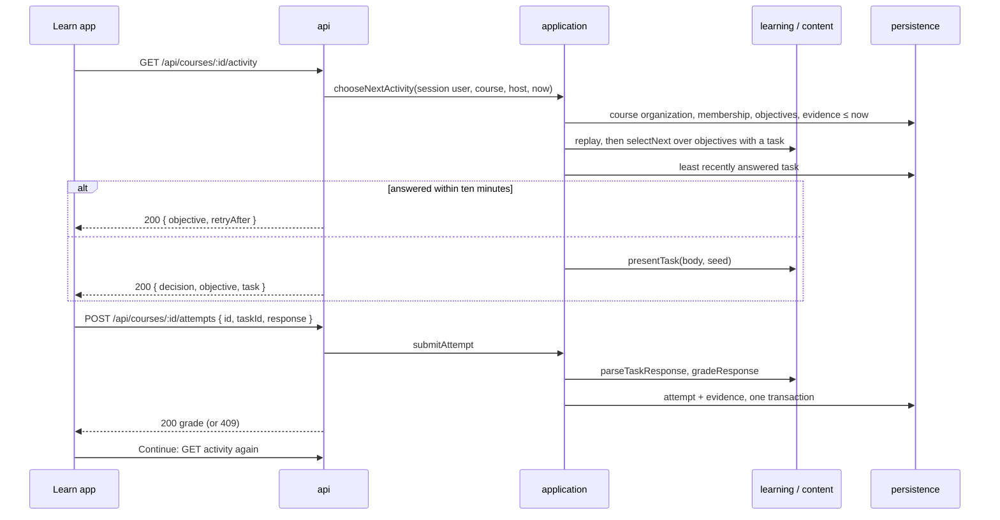

# Learner loop

Status: living; checked against the code on 2026-10-02.

A learner opens a course and Braivo keeps choosing what to practise next from what they know, struggle with, or may be forgetting; each answer is graded into evidence that shapes the next choice. This is `product.md`'s core jobs 2 and 3, closed end to end without AI for `choice` tasks. Integrators who grade elsewhere feed the same estimates through the evidence endpoint.

## How it works

Every course route below is limited by the host ceiling ([white-label.md](white-label.md)), and the course list filtered by it; who is a learner in which organization is in [access.md](access.md), and how objectives, courses, and tasks are made is in [authoring.md](authoring.md).

| Endpoint                                            | Caller                | Answers                                                                                                                                           |
| --------------------------------------------------- | --------------------- | ------------------------------------------------------------------------------------------------------------------------------------------------- |
| `GET /api/courses`                                  | the session's learner | 200 `{ courses: [{ id, title }] }`: every course of every organization they are a member of, by title, only one organization's on its domain; 401 |
| `GET /api/courses/:id/next`                         | the session's learner | 200 learning decision; 204 caught up; 404 missing or not theirs; 401                                                                              |
| `GET /api/courses/:id/activity`                     | the session's learner | 200 `{ decision, objective, task }` or `{ objective, retryAfter }`; 204 no activity; 404; 401                                                     |
| `POST /api/courses/:id/attempts`                    | the session's learner | 200 grade; 400; 401; 403 forgeable; 404, also a retired task; 409 conflict or resting; 413                                                        |
| `POST /api/organizations/:id/learners/:id/evidence` | a content owner       | 204 recorded; 400; 401; 403; 409 conflicting; 413                                                                                                 |

Statuses and shapes in full: `apps/server/api/index.ts`. The learner is always the session's user on the course routes; nothing in the request names one.

**Deciding.** On each read, the learner's evidence at the course's organization up to `now` is replayed under the active model, and `selectNext` chooses from the course's objectives in content order ([learning-model.md](learning-model.md)). `/next` is that bare decision, for integrators with their own tasks. `/activity` first drops objectives with no task, so 204 there means no activity, not caught up.

**Choosing the task.** Retired tasks are never offered ([authoring](authoring.md)). For the decided objective, the task this learner answered least recently: never-answered first, then oldest created, then ID.

**Resting.** A task rests for this learner for `TASK_REST_MS` (ten minutes) after Braivo accepts an attempt on it. The chosen task is the least recently answered, so if it rests, every task of the objective rests; `/activity` then answers the objective and `retryAfter` in whole seconds, rounded up, and offers no other objective.

**Shuffling.** Options are shuffled by a seed of learner, task, and that learner's last attempt time, unless the task has `keepOrder`. A reload shows the same order; each accepted new attempt reseeds it. Each option carries its `choice`, and the response names that `choice`, never a position.

**Answering.** `submitAttempt` checks, in order: the attempt ID is 1–128 characters (400); the course exists, the host admits its organization, and the learner is a member (404); the task assesses one of the course's objectives (404); the response fits the task (400). It grades, then in one transaction inserts the attempt keyed by (learner, organization, ID):

- Same ID, task, and response already stored: nothing recorded, the same grade answered. The evidence keeps the first submission's date.
- Same ID, anything else: 409.
- New ID for a retired task: 404, rolled back. A resend of an attempt recorded before retirement still gets its grade.
- New ID, and this learner answered the task in another attempt within the rest: 409, rolled back.
- Otherwise the attempt and one evidence record, ID `attempt:<attemptId>:<objectiveId>`, dated `now`.

The grade is `{ outcome, correctChoice, explanation?, passages? }`, recomputed from the immutable task on every resend. `passages` are those the task cites ([authoring](authoring.md)), present only when it cites any: each its `quote`, its source's `title` and `url` if it has one, and `at`, the second of a timed transcript the words are said at, or `page`, the printed label of a paged document's page they are on ([sources](sources.md)). Never before grading, since a passage could give the answer away; never the source's text or positions.

**Evidence graded elsewhere.** An `owner` or `admin` posts up to 1000 records for a member. Each `at` must be exactly `toISOString` output and at most five minutes ahead; IDs are at most 256 characters, and those starting `attempt:` are reserved; every objective must be the organization's. The batch is all or nothing: resending a stored result is a no-op, a different result under an ID the organization already stored for the learner is 409. Another organization's IDs are its own and never collide. It enters the same replay, but creates no attempt, so it neither rests a task nor reseeds a shuffle. Only a session can post it.

**The learn app.** `/` lists the courses, or "No courses yet". `/courses/$courseId` loads the activity and mints one attempt ID per activity shown; above it, a summary of where the learner stands ([progress](progress.md)). It renders one of:

| State                            | Shows                                                                                                                                                       | Next                                                          |
| -------------------------------- | ----------------------------------------------------------------------------------------------------------------------------------------------------------- | ------------------------------------------------------------- |
| Task                             | label ("New · Greetings"), why now, prompt, options                                                                                                         | a choice or key 1–9 sends the attempt; options lock meanwhile |
| Graded                           | Correct or Not quite, the explanation, the correct option, and the passages under "From your lessons", each linked to its source, a recording at its moment | Continue reloads the activity, with a new attempt ID          |
| Unconfirmed (network error, 5xx) | "Your answer could not be confirmed."                                                                                                                       | Send again resends the same attempt and choice                |
| Refused (400, 403, 413)          | "Something went wrong."                                                                                                                                     | nothing; the same answer would be refused again               |
| 401, 404, 409 on an attempt      | —                                                                                                                                                           | reloads: to sign-in, not found, or the rest                   |
| Resting                          | the objective and the local time practice resumes                                                                                                           | reloads itself after `retryAfter`                             |
| No activity                      | "Nothing to practise right now"                                                                                                                             | nothing                                                       |
| 404                              | "This course does not exist, or is not one of yours."                                                                                                       | nothing                                                       |
| Load failed                      | "Something went wrong."                                                                                                                                     | Try again                                                     |

## Invariants

- The course routes act for the session's user and never for a learner named in the request (`apps/server/api/app.test.ts`).
- A missing course, another organization's course, a course the host does not admit, and a task outside the course answer alike: 404 (`apps/server/api/app.test.ts`, `apps/server/application/next-objective.test.ts`, `apps/server/application/activity.test.ts`).
- An activity never carries the answer, the explanation, or the task's passages (`apps/server/api/app.test.ts`, `apps/server/content/task.test.ts`, `apps/server/application/activity.test.ts`).
- A graded attempt carries the passages its task cites, with quote, source title and link, and the moment or page where the source keeps one (`apps/server/api/app.test.ts`, `apps/server/application/activity.test.ts`).
- A learner never chooses an outcome: attempts are graded by Braivo, and the evidence endpoint refuses a member grading themselves (`apps/server/application/record-evidence.test.ts`, `apps/server/api/app.test.ts`).
- One attempt ID at an organization yields at most one attempt and one evidence record; a resend answers the same grade, a different task or response is 409 (`apps/server/application/activity.test.ts`, `apps/server/api/app.test.ts`).
- A new answer to a task within ten minutes of the learner's last accepted one is refused and records nothing; a resend is not; another learner is unaffected (`apps/server/application/activity.test.ts`, `apps/server/api/client.contract.test.ts`).
- While every task of the decided objective rests, `/activity` waits instead of offering another objective (`apps/server/application/activity.test.ts`).
- `/activity` considers only objectives with a task (`apps/server/application/activity.test.ts`).
- A retired task is never offered and accepts no new attempt (`apps/server/application/tasks.test.ts`).
- Option order depends only on learner, task, and last attempt; `keepOrder` keeps the authored order (`apps/server/application/activity.test.ts`, `apps/server/content/task.test.ts`).
- No activity is never presented as caught up (`apps/server/api/client.test.ts`, `apps/learn/routes.test.tsx`).
- Evidence dated after `now` does not reach a decision (`apps/server/application/next-objective.test.ts`, `apps/server/application/learner-in-course.test.ts`).
- An evidence batch is stored whole or not at all; redelivery is a no-op, a conflicting result is 409 (`apps/server/persistence/evidence.test.ts`, `apps/server/application/record-evidence.test.ts`, `apps/server/api/app.test.ts`).
- A learner may study at several organizations at once: each records attempts and evidence only about its own tasks and objectives, under IDs of its own, and decides from its own evidence alone, so one organization's IDs never refuse or reveal another's; reports stay apart too (progress-10) (`apps/server/persistence/evidence.test.ts`, `apps/server/application/activity.test.ts`, `apps/server/application/learner-progress.test.ts`).
- Evidence dated more than five minutes ahead, or under an ID longer than 256 characters or starting `attempt:`, is refused (`apps/server/application/record-evidence.test.ts`, `apps/server/api/app.test.ts`).
- Every GET answers `private, no-store` (`apps/server/api/app.test.ts`).
- The learn app sends one attempt however many options are tapped, and resends only that attempt (`apps/learn/routes.test.tsx`).
- The learn app shows a grade's passages after answering, linking those whose source has a link, a recording at its moment (`apps/learn/routes.test.tsx`, `packages/ui/compositions/source-passage.test.tsx`).

## Code map

| Concern                                    | Where                                                                                             |
| ------------------------------------------ | ------------------------------------------------------------------------------------------------- |
| Routes and status mapping                  | `apps/server/api/app.ts`; contract prose in `apps/server/api/index.ts`                            |
| Browser client                             | `apps/server/api/client.ts` (`learnerCourses`, `nextActivity`, `submitAttempt`, `recordEvidence`) |
| Decision, activity, attempt, rest          | `apps/server/application/next-objective.ts`, `activity.ts`, `learner-in-course.ts`                |
| Course list                                | `apps/server/application/courses.ts` (`listLearnerCourses`)                                       |
| Evidence graded elsewhere                  | `apps/server/application/record-evidence.ts`, `apps/server/persistence/evidence.ts`               |
| Task shape, presentation, shuffle, grading | `apps/server/content/task.ts`                                                                     |
| Task choice, attempt storage, passages     | `apps/server/persistence/task.ts` (`readNextTask`, `recordAttempt`, `readTaskCitations`)          |
| Replay and selection                       | `apps/server/learning/` ([learning-model.md](learning-model.md))                                  |
| Learn app pages                            | `apps/learn/routes/_signed-in/index.tsx`, `apps/learn/routes/_signed-in/courses/$courseId.tsx`    |
| A passage as shown                         | `packages/ui/compositions/source-passage.tsx`                                                     |

## Decisions

- [ADR 0007](../adr/0007-one-learning-model.md): one active model; estimates are replayed, not stored.
- [ADR 0008](../adr/0008-courses-order-objectives.md): a course orders objectives, which is the candidate list.
- [ADR 0009](../adr/0009-evidence-read-whole.md): a decision replays the learner's evidence at the course's organization, never narrowed to the course.
- [ADR 0032](../adr/0032-learner-history.md): evidence and attempts record their organization, their IDs are unique within it, and a decision reads only its organization's.
- [ADR 0010](../adr/0010-hono-http-layer.md): the HTTP layer, and routes that call one use case.
- [ADR 0015](../adr/0015-tasks.md): immutable tasks, Braivo grades, client-named attempts, task availability as eligibility.
- [ADR 0017](../adr/0017-task-rest.md): the ten-minute rest, waiting rather than switching objective, 409 rather than 429.
- [ADR 0021](../adr/0021-citations.md): a learner sees a task's passages in the grade, never before.
- [ADR 0018](../adr/0018-sign-in-and-invitations.md): organization membership stands in for course enrollment.

## Gaps

| Gap                                                                                                                                    | Impact                                                                                    | Next step                                                                           |
| -------------------------------------------------------------------------------------------------------------------------------------- | ----------------------------------------------------------------------------------------- | ----------------------------------------------------------------------------------- |
| `/activity` drops objectives without a task before selection, so one `acquiring` from outside evidence no longer holds back later ones | Content order silently stops sequencing new material (untested)                           | Decide whether such an objective blocks or is skipped; pin it in `activity.test.ts` |
| No activity is a dead end: no retry, no reason, and a due objective without a task looks the same as caught up                         | Learner cannot tell whether to come back; nobody is told a task is missing                | Tell content owners which objectives lack tasks; auto-retry or explain in the app   |
| Course page shows no course title and no link back to the list                                                                         | Learner navigates only by browser back                                                    | Return the title with the activity or load it; add a back link                      |
| Course list load failure falls to the root error, with no retry button                                                                 | A transient failure strands the learner (untested)                                        | Give `/` an error component with Try again, as the course page has                  |
| Two new attempts on one task at the same moment can both be recorded (ADR 0017)                                                        | Rest bypassable by racing requests (untested)                                             | Lock per learner and task if it is seen                                             |
| Attempts are not bound to a served activity: any course task outside its rest may be answered                                          | Fine for practice, not for assessment (ADR 0015)                                          | Server-issued binding when assessment is needed                                     |
| Every read replays the learner's whole history at the organization                                                                     | Cost grows without bound per learner (ADR 0009)                                           | Cache estimates once measured to matter                                             |
| The evidence endpoint accepts only a session                                                                                           | No server-to-server integration yet (`architecture.md`)                                   | ADR for a machine credential                                                        |
| Only `choice` tasks; feedback is right or wrong plus the author's optional explanation                                                 | No free-text answers, AI grading, or feedback on the learner's own work; core job 4 unmet | Next task kind per ADR 0015                                                         |
