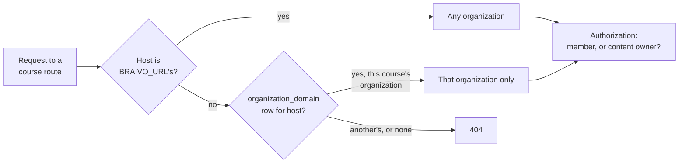

# White-label

Status: living; checked against the code on 2026-09-27.

Each organization's learners use the learn app on the organization's own hostname, which wears its name and serves its courses alone; its content owners manage it in one console at `braivo.app/<slug>` (product.md, core job 6). Which hostname serves which organization is a database row, not configuration.

## How it works

### Origins

One server process sits behind every origin, and every origin that serves an app also serves `/api`, so apps only call their own origin.

| Origin                                           | Serves                                                | Session today                         | Hostname controlled by                 |
| ------------------------------------------------ | ----------------------------------------------------- | ------------------------------------- | -------------------------------------- |
| `BRAIVO_URL` (`braivo.app` on Cloud)             | Console at `/`, sign-in, `/api`                       | The account's, host-only cookie       | Operator                               |
| An organization's domain (`acme.braivo.app`)     | That organization's learn app, `/api`                 | The account's, signed in on that host | Operator (the only kind allowed today) |
| A customer's own domain (`learn.school.example`) | Not allowed until learn domains hold learner sessions | —                                     | Customer                               |
| `www.braivo.app`                                 | Marketing, Braivo Cloud only, outside this repository | None                                  | Braivo                                 |

`organization_domain` maps a hostname to an organization: lowercase, no port (a database check), at most one per organization (a unique index), deleted with its organization. Only SQL writes it today.

### The host ceiling

The host a request was sent to limits which organization it may reach. It runs before authorization, never grants anything, and answers a refused course exactly as a missing one (404), so a domain learns nothing about other organizations.

- Every course route applies it: the learner's `next`, `activity` and `attempts`, and the content owner's `progress`. The organization routes (`/api/organizations/…`) do not: they serve the console, on the installation's host. `GET /api/courses` applies it as a filter: on a domain, that organization's courses; on any other host but the installation's, none.
- An unknown host reaches nothing, so deleting a domain's row revokes access rather than widening it.

### Trusted origins

Better Auth and Braivo's write check ([access](access.md)) trust `BRAIVO_URL`'s origin, plus `https://<hostname>` on the default port while an `organization_domain` row maps it, looked up on every request.

### Branding

The learn app reads `GET /api/organization` before sign-in, once per visit: the name of the organization its host serves, or 404 when none. It shows that name; a failure leaves the app unbranded rather than down. Name only: no logo, colours, or favicon.

### Console addressing

| Path                                                          | Page                                                                                                                                                |
| ------------------------------------------------------------- | --------------------------------------------------------------------------------------------------------------------------------------------------- |
| `/`                                                           | Signed in: the organization last opened in this browser, while still managed, else the only one managed, else `/organizations`. Anonymous: `/login` |
| `/organizations`                                              | Organizations the user manages (`owner` or `admin`); managing none, where learners go instead                                                       |
| `/<slug>`, `/<slug>/courses/<course>`, `…/learners/<learner>` | The organization's console                                                                                                                          |
| `/login`, `/signup`                                           | Sign-in ([access](access.md))                                                                                                                       |

The URL names the organization, never the session: Better Auth's active organization is unused. The last organization opened is kept in `localStorage` by ID, not slug, and written when the page renders, not in `beforeLoad`, which preloading also runs. `_signed-in/$organizationSlug/route.tsx` resolves the slug among the organizations the user manages; an unknown slug is not found, and child pages read `context.organization`.

### Slugs

- Lowercase letters, digits and single hyphens, at most 63 characters, checked in Better Auth's create hook.
- Reserved: the console's root paths, `api`, `assets`, `invitations`, `login`, `organizations`, `signup`.
- Never changed: the update hook refuses a different slug and accepts the current one resent.

## Invariants

- A domain never serves another organization's course or course list (`apps/server/api/app.test.ts`, `apps/server/application/learner-in-course.test.ts`, `apps/server/application/activity.test.ts`).
- A host serving no organization reaches no course (`apps/server/api/app.test.ts`, `apps/server/application/learner-in-course.test.ts`).
- An origin is trusted only while its domain row exists, and only over HTTPS (`apps/server/auth/origin.test.ts`, `apps/server/auth/auth.test.ts`).
- Every root-level console route is a reserved slug (`apps/server/auth/slug.test.ts`).
- A slug is never changed, and a reserved or malformed one never created (`apps/server/auth/auth.test.ts`).
- `/` never opens an organization the user no longer manages, and a slug the user does not manage reads as not found (`apps/console/routes.test.tsx`).
- The learn app's brand never blocks it from loading (`apps/learn/routes.test.tsx`).
- At most one domain per organization (untested; a unique index).

## Code map

| Concern            | Where                                                                                                                         |
| ------------------ | ----------------------------------------------------------------------------------------------------------------------------- |
| Domain table       | `packages/db/schema/domain.ts`                                                                                                |
| Host ceiling       | `apps/server/application/host.ts` (`hostAdmits`, `RequestHost`), `requestHost` in `apps/server/api/app.ts`                    |
| Course list filter | `listLearnerCourses` in `apps/server/application/courses.ts`                                                                  |
| Origin trust       | `apps/server/auth/origin.ts`, `trustedOrigins` in `apps/server/auth/auth.ts`, `isTrustedWrite` in `apps/server/api/app.ts`    |
| Branding           | `GET /api/organization` in `apps/server/api/app.ts`, `apps/learn/routes/__root.tsx`                                           |
| Slugs              | `apps/server/auth/slug.ts`, organization hooks in `apps/server/auth/auth.ts`                                                  |
| Console addressing | `apps/console/routes/_signed-in/index.tsx`, `_signed-in/$organizationSlug/route.tsx`, `apps/console/lib/last-organization.ts` |

## Decisions

- [ADR 0004](../adr/0004-one-application-origin.md): origins, console at `/<slug>`, the host ceiling, one domain per organization, operator-controlled hostnames only, marketing on `www`.
- [ADR 0018](../adr/0018-sign-in-and-invitations.md): learner sessions per learn domain, which admit customer-owned domains.
- [ADR 0016](../adr/0016-route-files.md): route files, including `$organizationSlug/route.tsx` as a layout.

## Gaps

| Gap                                                                                                                                  | Impact                                                     | Next step                                                                  |
| ------------------------------------------------------------------------------------------------------------------------------------ | ---------------------------------------------------------- | -------------------------------------------------------------------------- |
| A learn domain holds the account's session, so only operator-controlled hostnames may be registered; enforced by a written rule only | High once a customer asks for its own domain               | Learner sessions and handoff (ADR 0018, step 2)                            |
| Nothing but SQL registers a domain                                                                                                   | Every new organization needs database access               | A CLI command beside `organization create`; provisioning on Cloud          |
| Slugs cannot be changed                                                                                                              | A typo in a slug is permanent without SQL                  | Owner or admin rename with the warning (ADR 0004)                          |
| Branding is the name only                                                                                                            | Weak white-label: no logo, colours, favicon, or page title | A branding slice: which fields, where stored, how the learn app loads them |
| The organization routes have no host ceiling, so on a learn domain an owner's session reaches every organization they manage         | Acceptable while only operator hostnames are registered    | Refuse them off `BRAIVO_URL` when learner sessions land                    |
| No deployment packaging for multiple hosts                                                                                           | Self-hosters must build their own proxy that passes `Host` | Deployment docs or packaging (README, Deployment)                          |
